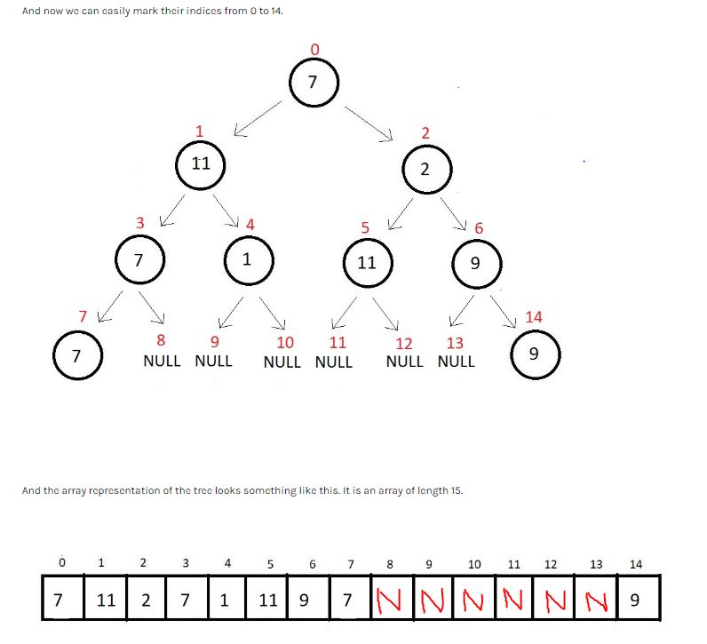
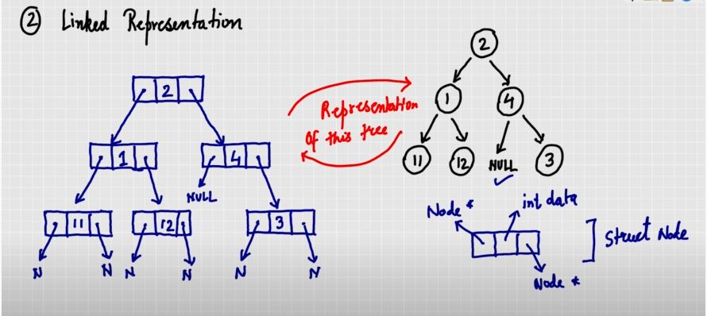
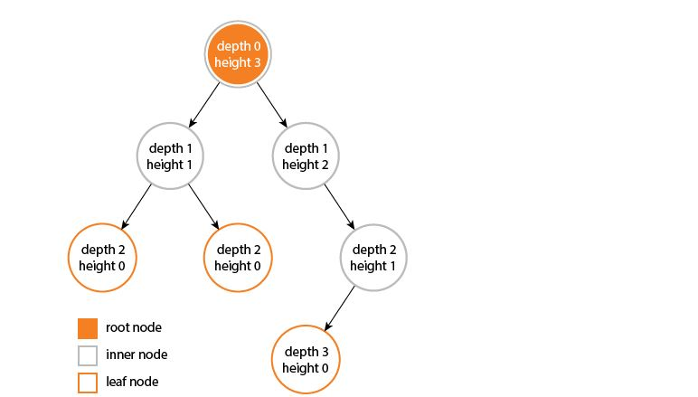

<h1><center>Tree Data Structure</center></h1>

Tree is a *non-linear* data structure. It is ideal for representing *hirearchical data*.

## Common Terminologies used in Trees:

1. Root : Topmost node.

2. Parent :  Node which connects to the child.

3. Child: Node which originates from parent.

4. Sibling: Nodes belonging to the same parent.

5. Leaf/External : Node with no children.

6. Internal: Nodes with at least one child.

7. Depth: No of arrows (or edges) from root to that node.The depth of Root node is zero.

8. Height: No of arrows (or edges) from that node to the deepest leaf (corresponding to that node). Consider the root node to find the height of the tree. The height of a leaf node is zero.

9. Ancestors and Descendants : Parent node or parent of parent node and child node or child of child node, respectively.

10. Degree (of a Node) : No of direct children of that node

11. Degree (of a Tree): Highest degree of a node present in that tree.

## Binary Tree 
It is a tree with its each node having a max degree of 2.

**Types of Binary Tree:**

1. Full or Strict BT: All nodes must have either 0 or 2 children. 

2. Perfect BT:  Internal nodes should have 2 children & all leaf nodes should be on same level

3. Complete BT: All levels should be completely filled. If the last level is not completely filled, it should have its nodes aligned to the left.   

4. Degenerate BT: Each parent node should have exacly one child. It is of two types:

   1. Left-skewed BT: All the child nodes are aligned to the left.

   2. Right-skewed BT: All the child nodes are aligned to the right.
    
**Representation of Binary Tree:**

- Array Representation: Inefficient as insertion, deletion operation are very costly.

  If a Node is at index i in the array (for 0 based index)
  - its left child is at `2*i+1`
  - its right child is at `2*i+2`
  - its parent is at `(i-1)/2` (floor)
  - For a missing child, we must leave the corresponding space blank

  
  
- Linked Representation: We use doubly linked list for this purpose.

  
 
```
  struct node{
      int data;
      struct node* left;
      struct node* right;
  };

```
- Depth and Height of a Binary Tree

  
